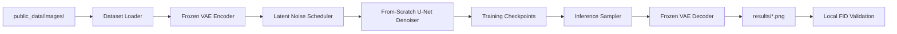

# High-Level Design

## Overview

This project implements an HW5 solution for unconditional professor face generation. The system trains a diffusion denoising U-Net from scratch in the latent space of the allowed `stabilityai/sd-vae-ft-mse` VAE, then uses the trained checkpoint to generate 3,000 RGB PNG images at 256x256 resolution for Codabench FID evaluation and E3 submission.

The final implementation should live under `code/` for packaging. The provided `public_data/sample_code/train.py` and `public_data/sample_code/inference.py` are treated as reference scaffolds, not the final source location.

## Goals

- Train a legal latent diffusion model using only `public_data/images/` as training data.
- Use the allowed pretrained VAE only for pixel-to-latent and latent-to-pixel conversion.
- Initialize and train the denoising U-Net from scratch.
- Generate exactly 3,000 PNG images at 256x256 resolution.
- Support local development on an RTX 4050 and higher-quality training or inference on Colab A100.
- Package final deliverables as `hw5_{student_id}/code`, `hw5_{student_id}/model`, and `hw5_{student_id}/results`.
- Optimize for the best achievable FID within available compute, with the strong baseline `FID < 50` as an important milestone rather than a stopping point.

## Non-Goals

- No additional scraped data is included in the first design.
- No pretrained generative model, pretrained U-Net, CLIP model for generation, or other forbidden pretrained generator is used.
- No training images are copied, transformed, or otherwise included in generated `results/`.
- The design does not introduce a new training framework beyond the package family already implied by the sample code and proposal.

## Requirements Summary

| Area | Requirement |
| --- | --- |
| Data | Use `public_data/images/` professor face PNGs only. |
| VAE | Use `stabilityai/sd-vae-ft-mse` for encoding and decoding only. Keep it frozen. |
| U-Net | Use a from-scratch `diffusers.UNet2DModel` or equivalent from-scratch denoiser. |
| Training target | Predict Gaussian noise added to VAE latents with MSE loss. |
| Scheduler | Use a DDPM-compatible scheduler for training noise and reverse sampling. |
| Output | Produce exactly 3,000 PNG files, each RGB and 256x256. |
| Scoring | Validate with the provided FID scorer and reference `ref/test_mu.npy` / `ref/test_sigma.npy`. |
| Packaging | E3 zip must unzip to `hw5_{student_id}/code`, `model`, and `results`. |

## Proposed Architecture

The system is organized as a small training and generation pipeline:

Training reads and normalizes images, encodes them into VAE latents, samples random timesteps and Gaussian noise, trains the U-Net to predict that noise, and periodically saves checkpoints plus preview generations. Inference loads a saved checkpoint, starts from random latent noise, runs reverse diffusion, decodes final latents to pixel space, and writes sequential PNG files.

## Modules

| Module | Responsibility | Inputs | Outputs | Owned Data | Dependencies |
| --- | --- | --- | --- | --- | --- |
| Configuration and CLI | Parse reproducibility, path, model, training, sampling, and packaging options. | Command-line arguments. | Runtime config object or namespace. | No persistent data. | Python `argparse`, local defaults. |
| Dataset Loader | Load only `public_data/images/`, convert images to RGB, resize to 256x256, normalize to `[-1, 1]`. | Image directory path. | Batches of normalized image tensors. | Sorted image path list. | PIL, torchvision transforms, DataLoader. |
| VAE Adapter | Encapsulate frozen VAE encode/decode and scaling-factor handling. | Pixel tensors or latent tensors. | Latent tensors or decoded image tensors. | No trainable state. | `AutoencoderKL.from_pretrained("stabilityai/sd-vae-ft-mse")`. |
| U-Net Factory | Build the legal from-scratch latent denoiser. | Architecture config. | `UNet2DModel` instance. | Randomly initialized U-Net weights. | `diffusers.UNet2DModel`, PyTorch. |
| Training Loop | Add scheduler noise to latents, predict noise, compute MSE, update U-Net, log and checkpoint. | Data batches, VAE, U-Net, scheduler, optimizer config. | Checkpoints, logs, preview samples. | U-Net checkpoints and optimizer progress if saved. | PyTorch, `DDPMScheduler`, tqdm, optional TensorBoard. |
| Preview Sampler | Generate small sample grids during training for qualitative checks. | Current U-Net checkpoint in memory, VAE, scheduler, sample count. | Preview PNGs under training outputs. | Preview image files. | VAE Adapter, scheduler, torchvision/PIL. |
| Inference Sampler | Generate final 3,000 images from a saved checkpoint. | Checkpoint directory, output directory, sample count, batch size, seed. | Sequential PNG files. | Generated result images. | U-Net checkpoint, VAE Adapter, scheduler. |
| Validation Runner | Check output contract and compute local FID with provided scorer. | Generated results folder, `ref/` stats, scoring program. | FID score and validation errors if any. | Score JSON from scorer. | `scoring_program/score.py`, `ref/config.json`. |
| Packaging Assembler | Arrange final code, model, and results into E3 structure. | Final code files, checkpoint, generated images, student ID. | `hw5_{student_id}/` folder ready to zip. | Submission folder. | Filesystem operations. |

## Module Relationships

- The Configuration and CLI module supplies paths and hyperparameters to every executable module.
- The Dataset Loader feeds pixel batches to the VAE Adapter during training.
- The VAE Adapter owns the only pretrained model dependency and must remain frozen.
- The Training Loop owns optimization and checkpoint creation for the U-Net.
- The Preview Sampler and Inference Sampler share the same reverse diffusion logic, but inference owns the final 3,000-image output contract.
- The Validation Runner consumes generated images and reference statistics; it does not feed results back into training automatically.
- The Packaging Assembler depends on successful inference and validation outputs.

## Data Flow

Training flow:

1. Read PNG files from `public_data/images/`.
2. Convert each image to RGB, resize to 256x256, and normalize to `[-1, 1]`.
3. Encode the batch with the frozen VAE.
4. Multiply latents by `vae.config.scaling_factor`.
5. Sample Gaussian noise and random timesteps.
6. Use `DDPMScheduler.add_noise` to produce noisy latents.
7. Predict noise with the from-scratch U-Net.
8. Optimize MSE between predicted noise and true sampled noise.
9. Save checkpoints with `save_pretrained()` and write preview images periodically.

Inference flow:

1. Load the trained U-Net checkpoint from `model/` or an experiment checkpoint directory.
2. Load the frozen VAE.
3. Initialize random latent noise with shape matching the VAE latent space for 256x256 images.
4. Run the scheduler reverse process for the configured number of sampling steps.
5. Divide final latents by `vae.config.scaling_factor`.
6. Decode latents to pixels, clamp to valid range, convert to RGB PNG, and save as sequential filenames.
7. Validate count, size, and FID with the provided scorer.

## Interfaces and Contracts

### Training CLI

The training entrypoint under `code/` should expose:

- `--image_dir`, defaulting to `public_data/images` when run from the project root.
- `--output_dir` for checkpoints, logs, and previews.
- `--epochs` or `--max_train_steps`.
- `--batch_size`.
- `--gradient_accumulation_steps`.
- `--learning_rate`.
- `--seed`.
- `--save_freq`.
- `--eval_freq`.
- U-Net capacity settings such as block channels and layers per block.

### Inference CLI

The inference entrypoint under `code/` should expose:

- `--checkpoint_dir`.
- `--output_dir`, defaulting to a result directory rather than overwriting training data.
- `--num_samples`, defaulting to `3000`.
- `--batch_size`.
- `--num_inference_steps`.
- `--seed`.
- `--device`.

### Checkpoint Contract

U-Net checkpoints should be saved with `UNet2DModel.save_pretrained()` so `UNet2DModel.from_pretrained()` can load them during inference. Checkpoints should include the U-Net config needed to reconstruct the architecture.

### Output Contract

The final result directory must contain exactly 3,000 PNG images. Each image must be RGB and 256x256. Filenames should be deterministic and sequential, for example `0000.png` through `2999.png`.

## Compute Profiles

The following profiles are design defaults, not assignment requirements. They should remain configurable because actual memory limits depend on the selected U-Net width, batch size, image transforms, precision, and Colab runtime state.

| Profile | Purpose | Suggested Direction |
| --- | --- | --- |
| RTX 4050 local | Smoke tests, code validation, short experimental runs. | Smaller U-Net, lower batch size, gradient accumulation, frequent small previews. |
| Colab A100 | Main quality training and final image generation. | Wider U-Net, larger effective batch size, longer training, more inference steps, checkpoint comparison by local FID and visual quality. |

The implementation should first prove end-to-end correctness on the RTX 4050 with a short run, then use the A100 for the main training sweep.

## Operational Considerations

- Set and log the random seed for training and inference.
- Keep the VAE in evaluation mode and disable its gradients.
- Keep generated previews separate from final `results/` to avoid accidental submission of the wrong folder.
- Run a small inference test after every major checkpoint format change.
- Preserve output directories intentionally; do not batch-delete generated folders. If cleanup is needed, delete only specific files with clear paths or ask for manual cleanup.
- Treat local FID as a selection signal, not a guarantee of Codabench ranking, because runtime and packaging differences can still cause submission failures.

## Risks and Tradeoffs

| Risk | Impact | Mitigation |
| --- | --- | --- |
| U-Net too small | Low-quality or blurry samples, high FID. | Use A100 profile to increase capacity after smoke tests pass. |
| U-Net too large | Out-of-memory errors or slow iteration. | Keep capacity configurable and validate on small batches first. |
| Incorrect latent scaling | Broken training or washed-out decoded images. | Centralize VAE scaling in the VAE Adapter and test encode/decode paths. |
| Scheduler mismatch | Training and inference distributions diverge. | Use the same scheduler configuration unless an experiment explicitly changes it. |
| Result count or size mismatch | Scoring failure. | Run `scoring_program/score.py` with `ref/config.json` before packaging. |
| Training-image leakage | Zero score if detected. | Generate from noise only and keep results separate from training data. |
| Distribution overfitting | Better previews but worse FID diversity. | Compare checkpoints with local FID and visual diversity checks. |

## Open Questions

- Which exact student ID should be used for the final `hw5_{student_id}` package name?
- Which concrete A100 training budget will be available for the main run, measured in hours or maximum training steps?
- Should final checkpoint selection be based on the best local FID only, or require a manual visual-quality gate before final generation?
